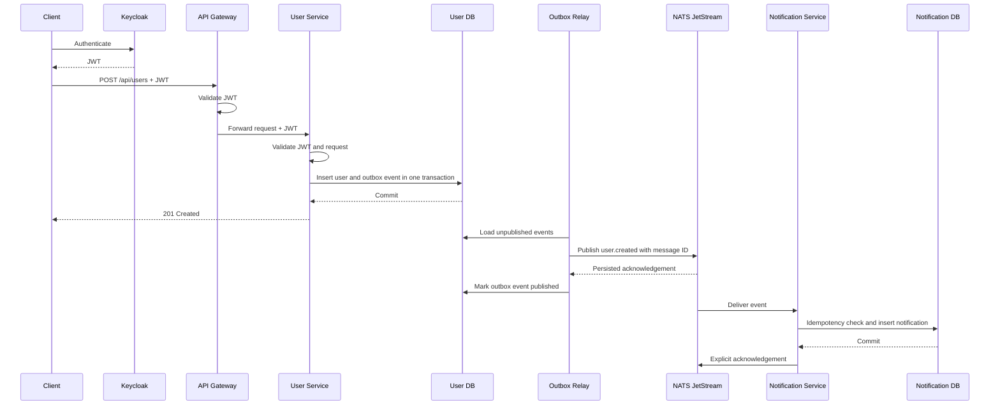

# Architecture

## Component Diagram

```text
                    ┌──────────────────┐
                    │     Keycloak     │
                    │   OAuth2 / JWT   │
                    └────────┬─────────┘
                             │ JWKS
                             ▼
┌────────────┐     ┌──────────────────┐
│ API Client │────►│   API Gateway    │
└────────────┘ JWT │      :8080       │
                   └────────┬─────────┘
                            │ REST + JWT
                            ▼
                   ┌──────────────────┐
                   │   User Service   │
                   │      :8081       │
                   └────┬────────┬────┘
                        │        │ Transactional Outbox
             PostgreSQL │        ▼
                        │   ┌──────────────────┐
                        ▼   │  NATS JetStream  │
              ┌────────────┐└────────┬─────────┘
              │  User DB   │         │ user.created
              └────────────┘         ▼
                            ┌──────────────────────┐
                            │ Notification Service │
                            │        :8082         │
                            └──────────┬───────────┘
                                       │ PostgreSQL
                                       ▼
                            ┌──────────────────────┐
                            │   Notification DB    │
                            └──────────────────────┘
```

Only the API Gateway is a public business endpoint. Notification Service does not expose a business REST API, and the backend services never communicate through REST or WebSockets.

## User Creation Sequence



## Delivery Semantics

The system provides at-least-once delivery with idempotent consumption:

1. User and outbox event are committed atomically.
2. The relay retries unpublished events after NATS failures.
3. A crash after NATS accepts an event but before the outbox row is marked can publish it again.
4. JetStream uses the outbox UUID as `Nats-Msg-Id` for duplicate suppression.
5. Notification Service additionally treats the source user ID as an idempotency key.
6. A database unique constraint prevents duplicate notifications even if duplicate deliveries race.
7. Notification Service acknowledges only after the database operation completes.

## Failure Behavior

| Failure | Behavior |
|---|---|
| NATS unavailable during user creation | User and outbox event commit; relay retries later |
| Relay crashes before publish | Event remains unpublished and is retried |
| Relay crashes after broker acknowledgement | Event may be republished; broker and consumer deduplication handle it |
| Notification persistence fails | Consumer sends delayed NAK; JetStream redelivers |
| Notification Service is offline | Durable consumer retains pending delivery state |
| Invalid or missing JWT | Gateway returns `401`; User Service also rejects direct unauthenticated requests |
| Duplicate email | User Service returns `409 Conflict` |

## Scaling

- API Gateway and stateless request handling can scale horizontally.
- User and Notification Services own independent data stores.
- JetStream decouples request throughput from notification processing.
- Durable consumer configuration preserves delivery state across restarts.
- For multiple Notification Service replicas, use a shared durable queue subscription in the next deployment iteration.
- For multiple User Service relay replicas, add database row claiming with `FOR UPDATE SKIP LOCKED` or use change-data-capture for the outbox table.

## Security Boundaries

- Keycloak issues JWTs; Gateway and User Service validate issuer and signature against JWKS.
- NATS accounts use independent passwords and subject-level publish/subscribe permissions.
- Application and database credentials are injected through environment variables.
- Backend application ports are not published by Docker Compose.
- Containers run as a non-root user.
- Local Compose uses development HTTP endpoints. Production deployment must add TLS, external secret management, and production-mode Keycloak.
